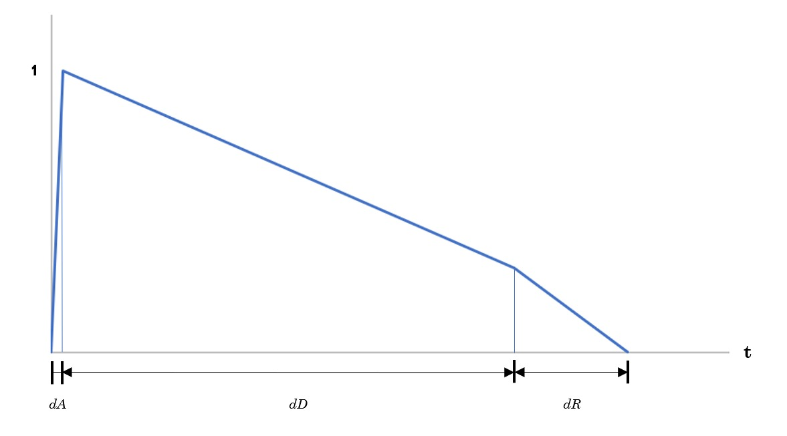

PAV - P5: síntesis musical polifónica
=====================================

Obtenga su copia del repositorio de la práctica accediendo a [Práctica 5](https://github.com/albino-pav/P5) y
pulsando sobre el botón `Fork` situado en la esquina superior derecha. A continuación, siga las instrucciones de la
[Práctica 3](https://github.com/albino-pav/P3) para crear una rama con el apellido de los integrantes del grupo de
prácticas, dar de alta al resto de integrantes como colaboradores del proyecto y crear la copias locales del
repositorio.

Como entrega deberá realizar un *pull request* con el contenido de su copia del repositorio. Recuerde que los
ficheros entregados deberán estar en condiciones de ser ejecutados con sólo ejecutar:

~~~~~~~~~~~~~~~~~~~~~~~~~~~~~~~~~~~~~~~~~~~~~~~~~~~~~.sh
  make release
~~~~~~~~~~~~~~~~~~~~~~~~~~~~~~~~~~~~~~~~~~~~~~~~~~~~~

A modo de memoria de la práctica, complete, en este mismo documento y usando el formato *markdown*, los ejercicios
indicados.

Ejercicios.
-----------

### Envolvente ADSR.

Tomando como modelo un instrumento sencillo (puede usar el InstrumentDumb), genere cuatro instrumentos que permitan
visualizar el funcionamiento de la curva ADSR.

* Un instrumento con una envolvente ADSR genérica, para el que se aprecie con claridad cada uno de sus parámetros:
  ataque (A), caída (D), mantenimiento (S) y liberación (R).
  
    #### GENÉRICA
     
    
   > Esta gráfica presenta un tiempo de *decay* largo acompañado de un tiempo final de *release* muy corto. Seguidamente, los tiempos de * attack* y de *sustain* notables pero no tan amplios como el de *decay*. 
  
* Un instrumento *percusivo*, como una guitarra o un piano, en el que el sonido tenga un ataque rápido, no haya
  mantenimiemto y el sonido se apague lentamente.
  - Para un instrumento de este tipo, tenemos dos situaciones posibles:
    * El intérprete mantiene la nota *pulsada* hasta su completa extinción.
    
    #### PERCUSIVA_1
      
    
    * El intérprete da por finalizada la nota antes de su completa extinción, iniciándose una disminución rápida del
      sonido hasta su finalización.
    
    #### PECURSIVA_2
     
    
   >Estas dos gráficas presentan un tiempo de *decay* muy largo acompañado de un tiempo final de *release* muy largo también en el caso de la primera y notable en la segunda. Seguidamente, los tiempos de *attack* y de *sustain* son tendiendo a nulos y nulos respectivamente.
    
   
* Un instrumento *plano*, como los de cuerdas frotadas (violines y semejantes) o algunos de viento. En ellos, el
  ataque es relativamente rápido hasta alcanzar el nivel de mantenimiento (sin sobrecarga), y la liberación también
  es bastante rápida.
  
  
#### PLANA
 

>La plana como cabía esperar no tiene tiempo de *decay* y el cien por cien del tiempo está en *sustain* con los casi nulos tiempos de *attack* y *release* necesarios para que se levante y caiga la onda. Cabe destacar que estas envolventes no sólo se utilizan para la amplitud de la señal: también pueden usarse para controlar la evolución temporal de otros parámetros.  
##### Parámetros Finales
  | **Envolventes ADSR**   | ADSR_A | ADSR_D | ADSR_S | ADSR_R |
  |------------------------|:------:|:------:|:------:|:------:|
  | Genérica               | 0.3    |  0.5   |  0.4   |  0.2   |
  | Pecursiva_1            | 0.01   |  0.4   |  0     |  0.1   |
  | Pecursiva_2            | 0.01   |  0.6   |  0     |  0.6   |
  | Plana                  | 0.05   |  0     |  1     |  0.05  |

### Instrumentos Dumb y Seno.

Implemente el instrumento `Seno` tomando como modelo el `InstrumentDumb`. La señal **deberá** formarse mediante
búsqueda de los valores en una tabla.

- Incluya, a continuación, el código del fichero `seno.cpp` con los métodos de la clase Seno.

~~~~~~~~~~~~~~~~~~~~~~~~~~~~~~~~~~~~~~~~~~~~~~~~~~~~~.sh
 #include <iostream>
#include <math.h>
#include "seno.h"
#include "keyvalue.h"

#include <stdlib.h>

using namespace upc;
using namespace std;

Seno::Seno(const std::string &param) 
  : adsr(SamplingRate, param) {
  bActive = false;
  x.resize(BSIZE);

  /*
    You can use the class keyvalue to parse "param" and configure your instrument.
    Take a Look at keyvalue.h    
  */
  KeyValue kv(param);
  int N;

  if (!kv.to_int("N",N))
    N = 40; //default value
  
  //Create a tbl with one period of a sinusoidal wave
  tbl.resize(N);
  float phase = 0, step = 2 * M_PI /(float) N;
  index = 0;
  for (int i=0; i < N ; ++i) {
    tbl[i] = sin(phase);
    phase += step;
  }
}
~~~~~~~~~~~~~~~~~~~~~~~~~~~~~~~~~~~~~~~~~~~~~~~~~~~~~
~~~~~~~~~~~~~~~~~~~~~~~~~~~~~~~~~~~~~~~~~~~~~~~~~~~~~.sh
void Seno::command(long cmd, long note, long vel) {
  if (cmd == 9) {		//'Key' pressed: attack begins
    bActive = true;
    adsr.start();
    index = 0;
	  A = vel / 127.;
    fase = 0;
    f0 = pow(2,(note-69.)/12.)*440;
    nota = (tbl.size()/(double) SamplingRate)*f0;
  }
  else if (cmd == 8) {	//'Key' released: sustain ends, release begins
    adsr.stop();
  }
  else if (cmd == 0) {	//Sound extinguished without waiting for release to end
    adsr.end();
  }
}
~~~~~~~~~~~~~~~~~~~~~~~~~~~~~~~~~~~~~~~~~~~~~~~~~~~~~
~~~~~~~~~~~~~~~~~~~~~~~~~~~~~~~~~~~~~~~~~~~~~~~~~~~~~.sh
const vector<float> & Seno::synthesize() {
  if (not adsr.active()) {
    x.assign(x.size(), 0);
    bActive = false;
    return x;
  }
  else if (not bActive)
    return x;

  for (unsigned int i=0; i<x.size(); ++i) {
    fase = fmod(fase+nota,tbl.size());
    index = floor(fase);
    x[i] = A*(tbl[index]+(tbl[index++]-tbl[index])*(fase-index));
  }
  adsr(x); //apply envelope to x and update internal status of ADSR

  return x;
}
~~~~~~~~~~~~~~~~~~~~~~~~~~~~~~~~~~~~~~~~~~~~~~~~~~~~~

- Explique qué método se ha seguido para asignar un valor a la señal a partir de los contenidos en la tabla, e incluya
  una gráfica en la que se vean claramente (use pelotitas en lugar de líneas) los valores de la tabla y los de la
  señal generada.
  
~~~~~~~~~~~~~~~~~~~~~~~~~~~~~~~~~~~~~~~~~~~~~~~~~~~~~.sh
for (unsigned int i=0; i<x.size(); ++i) {
    fase = fmod(fase+nota,tbl.size());
    index = floor(fase);
    x[i] = A*(tbl[index]+(tbl[index+1]-tbl[index])*(fase-index));
  }
~~~~~~~~~~~~~~~~~~~~~~~~~~~~~~~~~~~~~~~~~~~~~~~~~~~~~  
  
  > Para asignar un valor a la señal a partir de los contenidos de la tabla hemos definido una nota que queríamos tocar, y acto seguido hemos definido una velocidad acorde. Seguidamente, tuvimos en cuenta a priori que puede ser que nos quedemos a medias yendo de un índice a otro y decidimos una solución como es la interpolación. Con la interpolación buscamos como prioridad que los índices siempre estuviesen en un "cajón" disponible de la tabla, siendo esos unos con índices de números enteros, ya que la velocidad definida en primer lugar puede no ser un múltiplo de la frecuencia.

### Efectos sonoros.

- Incluya dos gráficas en las que se vean, claramente, el efecto del trémolo y el vibrato sobre una señal sinusoidal.
  Deberá explicar detalladamente cómo se manifiestan los parámetros del efecto (frecuencia e índice de modulación) en
  la señal generada (se valorará que la explicación esté contenida en las propias gráficas, sin necesidad de
  *literatura*).
  
  
  
   
  
  	> El trémolo consiste en modular una señal en amplitud (AM). Es decir, genera el mismo efecto que si subimos y bajamos el volumen continuamente 

   
   
   
  
   
  
  	> El vibrato se basa en modular la señal en frecuencia (FM) o lo que es lo mismo: subir y bajar el tono.
   
   
  
 	 >Hemos analizado la misma señal usando en primer lugar el efecto del trémolo y seguidamente el vibrato, podemos ver los resultados obtenidos y las variaciones que supone cada uno de estos efectos:
  
  #### SEÑAL NORMAL
  
  
  #### TREMOLO
  
  
  > si nos fijamos en el trémolo vemos variación en la 'waveform' i el 'spectrogram'
  
  
  #### VIBRATO
  
  
  > en el vibrato vemos variación en el 'pitch contour'
  
- Si ha generado algún efecto por su cuenta, explique en qué consiste, cómo lo ha implementado y qué resultado ha
  producido. Incluya, en el directorio `work/ejemplos`, los ficheros necesarios para apreciar el efecto, e indique,
  a continuación, la orden necesaria para generar los ficheros de audio usando el programa `synth`.
  
  > El comando que utilizamos para implemtar el efecto es el siguiente:
  `synth dumb.orc effects.sco tremolo.wav -e effects.orc`
  > En la que usamos la envolvente dumb y hemos modificado la escala doremi.sco llamándola effects.sco añadiendo el efecto (en este caso tremolo) a lo largo de toda la escala.

### Síntesis FM.

Construya un instrumento basado en síntesis FM, siguiendo las explicaciones contenidas en el enunciado y el artículo
de [John M. Chowning](https://ccrma.stanford.edu/sites/default/files/user/jc/fm_synthesispaper-2.pdf). El instrumento
usará como parámetros **básicos** los números `N1` y `N2`, y el índice de modulación `I`, que deberá venir expresado
en semitonos.

- Use el instrumento para generar un vibrato de *parámetros razonables* e incluya una gráfica en la que se vea,
  claramente, la correspondencia entre los valores `N1`, `N2` e `I` con la señal obtenida.
- Use el instrumento para generar un sonido tipo clarinete y otro tipo campana. Tome los parámetros del sonido (N1,
  N2 e I) y de la envolvente ADSR del citado artículo. Con estos sonidos, genere sendas escalas diatónicas (fichero
  `doremi.sco`) y ponga el resultado en los ficheros `work/doremi/clarinete.wav` y `work/doremi/campana.work`.
  * También puede colgar en el directorio work/doremi otras escalas usando sonidos *interesantes*. Por ejemplo,
    violines, pianos, percusiones, espadas láser de la [Guerra de las Galaxias](https://www.starwars.com/), etc.

### Orquestación usando el programa synth.

Use el programa `synth` para generar canciones a partir de su partitura MIDI. Como mínimo, deberá incluir la
*orquestación* de la canción *You've got a friend in me* (fichero `ToyStory_A_Friend_in_me.sco`) del genial
[Randy Newman](https://open.spotify.com/artist/3HQyFCFFfJO3KKBlUfZsyW/about).

- En este (lamentable) arreglo, la pista 1 corresponde al instrumento solista (puede ser un piano, flautas, violines,
  etc.), y la 2 al bajo (bajo eléctrico, contrabajo, tuba, etc.).
- Coloque el resultado, junto con los ficheros necesarios para generarlo, en el directorio `work/music`.
- Indique, a continuación, la orden necesaria para generar la señal (suponiendo que todos los archivos necesarios
  están en direcotorio indicado).

También puede orquestar otros temas más complejos, como la banda sonora de *Hawaii5-0* o el villacinco de John
Lennon *Happy Xmas (War Is Over)* (fichero `The_Christmas_Song_Lennon.sco`), o cualquier otra canción de su agrado
o composición. Se valorará la riqueza instrumental, su modelado y el resultado final.
- Coloque los ficheros generados, junto a sus ficheros `score`, `instruments` y `efffects`, en el directorio
  `work/music`.
- Indique, a continuación, la orden necesaria para generar cada una de las señales usando los distintos ficheros.
